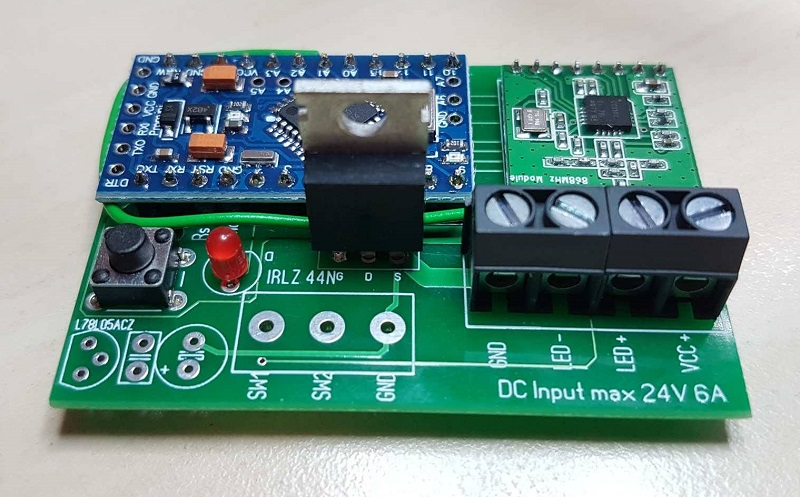
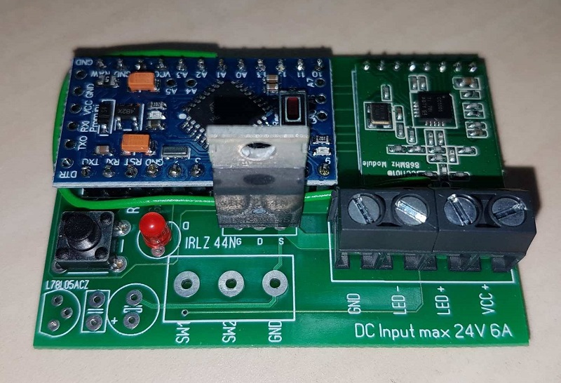
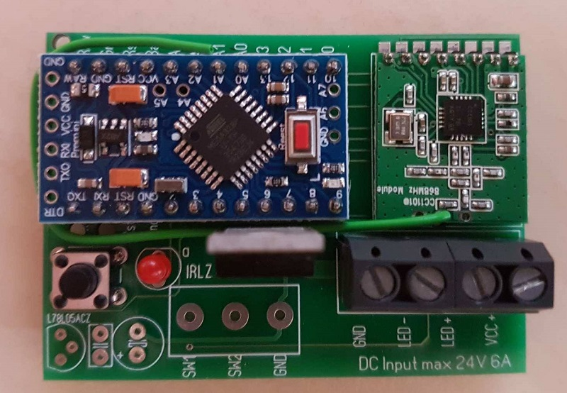

# HM-LC-Dim1PWM 12V
# 1 Fach Dimmer 12V, 5A

## benötigte Hardware
* 1x Arduino Pro Mini **ATmega328P (3.3V/8MHz)**
* 1x CC1101 Funkmodul **(868 MHz)**
* 1x FTDI Adapter (wird nur zum Flashen benötigt)
* 1x L78L05ACZ
* 1x Taster 6x6
* 1x Led 5mm
* 1x Widerstand 1/4W 330Ohm
* 1x Widerstand 1/4W 4,7k Ohm
* 1x Mosfet IRLZ44N 
* 1x ggf. Kühlkörper für mosfet
* 1x AKL 057-03 Anschlussklemme, 3-pol, alternativ 1x WAGO 250-503
* 2x AKL 057-02 Anschlussklemme, 2-pol, alternativ 1x WAGO 250-504

[Kontakt via Facebook](https://www.facebook.com/ronny.thomas.83)

[Software](https://github.com/pa-pa/AskSinPP/tree/master/examples/HM-LC-Dim1PWM-CV)

[Platine/Gerber](https://github.com/ronnythomas/HM-LC-Dim1PWM-12V-V1.5/tree/master/Gerber)

Bilder Christoph P.

